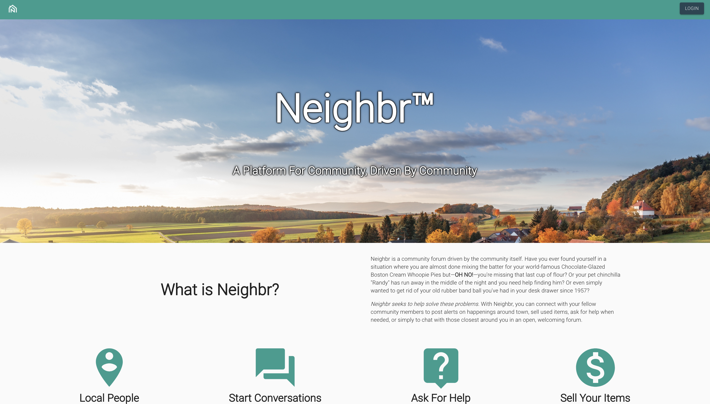

# Neighbr

## What is Neighbr?

Neighbr is a community forum driven by the community itself. Have you ever found yourself in a situation where you are almost done mixing the batter for your world-famous Chocolate-Glazed Boston Cream Whoopie Pies but—**OH NO!**—you're missing that last cup of flour? Or your pet chinchilla "Randy" has run away in the middle of the night and you need help finding him? Or even simply wanted to get rid of your old rubber band ball you've had in your desk drawer since 1957?

*Neighbr seeks to help solve these problems.* With Neighbr, you can connect with your fellow community members to post alerts on happenings around town, sell used items, ask for help when needed, or simply to chat with those closest around you in an open, welcoming forum.

## How to run locally

### Configuration

To run Neighbr locally, fork and clone this repository to your local directory. You'll need to add a **.env** file containing your desired MongoDb URI:

  > Example: `MONGOURI=mongodb+srv://<your-uri-here>`

You will also need these **config.js** files in these directories:

- client/src/components/Chat/config.js

  > Add your [React Chat Engine](https://chatengine.io/docs/getting_started) project key here

- client/src/helper-functions/config.js

  > Add your [Google Maps Embed](https://developers.google.com/maps/documentation/embed/get-started) API key here

- client/src/redux/actions/firebase/config.js

  > Add your [Firebase configuration](https://firebase.google.com/docs/firestore/quickstart) object here

- server/database/config.js

  > Add your global MongoDb URI here

Finally, you will need to add a Firebase private key in this directory:

  > server/firebase/`<YOUR_KEY_HERE>`.json

**To generate a private key file for your service account:**

  > - In the Firebase console, open **Settings > Service Accounts**.
  > - Click Generate New Private Key, then confirm by clicking Generate Key.
  > - Securely store the JSON file containing the key.

### Start The Server

To start the server, make sure you have all the configuration files listed above, then run:

  > **npm install**

  > **npm start**

## Navigating The Application

On startup, you will be greeted with the Neighbr landing page:

From here, you can click the *Login* button, and you will be prompted to either log into an existing account, or create a new one. The main feed page should now be visible. You can now access all of the features of the application via the top navigation bar, where you are given the option to create and filter posts, or view/change your user data.

To log out of the application, select the *logout* option on the menu dropdown on the upper right portion of the screen